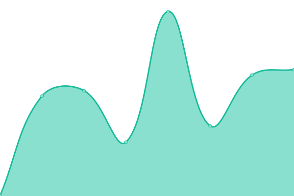

# [📈 Live Status](https://status.liuli.lol): <!--live status--> **🟧 Partial outage**

This repository contains the open-source uptime monitor and status page for [Gizmo](https://lumina.moe), powered by [Upptime](https://github.com/upptime/upptime).

With [Upptime](https://upptime.js.org), you can get your own unlimited and free uptime monitor and status page, powered entirely by a GitHub repository. We use [Issues](https://github.com/GizmoOAO/upptime/issues) as incident reports, [Actions](https://github.com/GizmoOAO/upptime/actions) as uptime monitors, and [Pages](https://status.liuli.lol) for the status page.

<!--start: status pages-->
<!-- This summary is generated by Upptime (https://github.com/upptime/upptime) -->
<!-- Do not edit this manually, your changes will be overwritten -->
<!-- prettier-ignore -->
| URL | Status | History | Response Time | Uptime |
| --- | ------ | ------- | ------------- | ------ |
|  [Blog](https://blog.lumina.moe) | 🟩 Up | [blog.yml](https://github.com/GizmoOAO/upptime/commits/HEAD/history/blog.yml) | 

 847ms
     
 | 

<a href="https://status.liuli.lol/history/blog">100.00%</a>
    

|  [utterances API](https://utterances-api.liuli.lol/) | 🟩 Up | [utterances-api.yml](https://github.com/GizmoOAO/upptime/commits/HEAD/history/utterances-api.yml) | 

 834ms
     
 | 

<a href="https://status.liuli.lol/history/utterances-api">100.00%</a>
    

|  [utterances](https://utterances.liuli.lol/) | 🟩 Up | [utterances.yml](https://github.com/GizmoOAO/upptime/commits/HEAD/history/utterances.yml) | 

 159ms
     
 | 

<a href="https://status.liuli.lol/history/utterances">100.00%</a>
    

|  [Bitwarden](https://bw.lumina.moe/) | 🟥 Down | [bitwarden.yml](https://github.com/GizmoOAO/upptime/commits/HEAD/history/bitwarden.yml) | 

 633ms
     
 | 

<a href="https://status.liuli.lol/history/bitwarden">100.00%</a>
    

<!--end: status pages-->

[**Visit our status website →**](https://status.liuli.lol)

## 📄 License

- Powered by: [Upptime](https://github.com/upptime/upptime)
- Code: [MIT](./LICENSE) © [Gizmo](https://lumina.moe)
- Data in the `./history` directory: [Open Database License](https://opendatacommons.org/licenses/odbl/1-0/)
